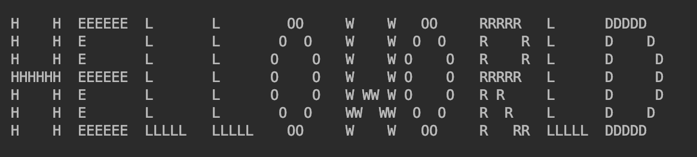

# large-scale-letters
a c++ program to print every string in large scale

if you entered a sample string message like "helloworld", it will print that like below.

this simple program is to illustrate using 3-dimensions array in c++.